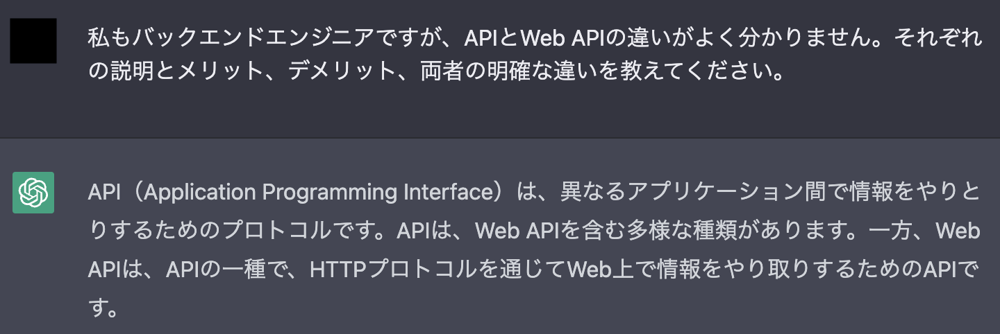
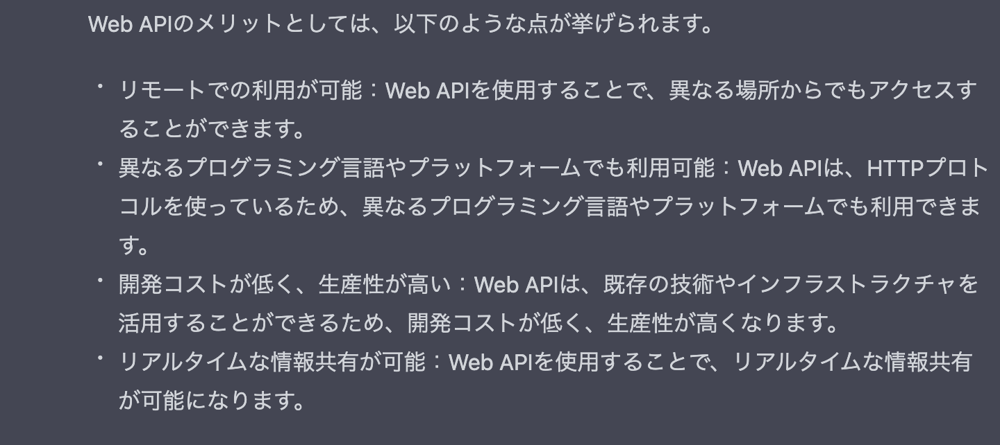
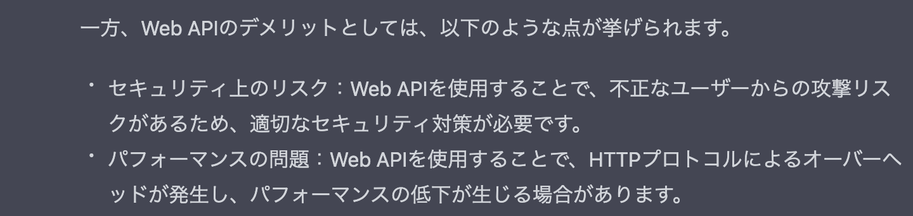
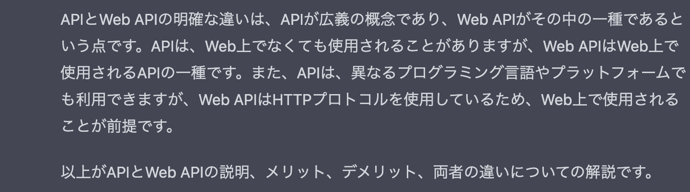

# API エンジニアリング









---

## 1

- 質問

  API の種類で SOAP がありますがご存知ですか？私は使ったことがないので、SOAP のリクエストとレスポンスの例を教えてほしいです。

- 回答

  はい、SOAP（Simple Object Access Protocol）は、XML を使用して Web サービスを提供するためのプロトコルで、主に企業や組織内で使用されています。

  SOAP では、XML 形式でリクエストとレスポンスがやりとりされます。以下は、SOAP のリクエストとレスポンスの例です。

  SOAP リクエスト例：

  ```xml
  <?xml version="1.0" encoding="UTF-8"?>
  <soap:Envelope xmlns:soap="http://www.w3.org/2003/05/soap-envelope" xmlns:example="http://www.example.com">
    <soap:Header>
        <example:auth>
          <example:username>user</example:username>
          <example:password>password</example:password>
        </example:auth>
    </soap:Header>
    <soap:Body>
        <example:getStockPrice>
          <example:symbol>ABC</example:symbol>
        </example:getStockPrice>
    </soap:Body>
  </soap:Envelope>
  ```

  SOAP レスポンス例：

  ```xml
  <?xml version="1.0" encoding="UTF-8"?>
  <soap:Envelope xmlns:soap="http://www.w3.org/2003/05/soap-envelope" xmlns:example="http://www.example.com">
    <soap:Header>
        <example:transactionId>1234567890</example:transactionId>
    </soap:Header>
    <soap:Body>
        <example:getStockPriceResponse>
          <example:symbol>ABC</example:symbol>
          <example:price>10.00</example:price>
        </example:getStockPriceResponse>
    </soap:Body>
  </soap:Envelope>
  ```

  この例では、SOAP のリクエストには、`getStockPrice` というメソッドがあり、`symbol` パラメータに `ABC` が指定されています。また、リクエストのヘッダには認証情報が含まれています。SOAP のレスポンスには、`getStockPriceResponse` というメソッドの結果として、`symbol` と `price` が返されています。

  SOAP は、XML 形式でのデータ交換を前提としているため、Web サービス間の相互運用性が高く、信頼性があります。ただし、XML のサイズが大きく、パフォーマンスが低下する可能性があるため、REST API など他の API の利用が増えている傾向にあります。

## 2

- 質問

  ありがとうございます。では、RESTful な API のリクエストとレスポンス例も同様に教えてください。

- 回答

  はい、では RESTful な API のリクエストとレスポンスの例を示します。

  RESTful な API は、HTTP プロトコルを使用して通信するため、リクエストとレスポンスのフォーマットは HTTP に基づいています。

  例えば、以下は、RESTful な API でリソースを取得するための GET リクエストの例です。

  RESTful な API のリクエスト例：

  ```vbnet
  GET /api/products/123 HTTP/1.1
  Host: example.com
  ```

  この例では、`/api/products/123`はリソースの場所を指定する URI で、`GET`は HTTP メソッドを示しています。また、リクエストヘッダには、API キーなどの認証情報が含まれている場合があります。

  RESTful な API のレスポンス例：

  ```css
  HTTP/1.1 200 OK
  Content-Type: application/json

  {
    "id": 123,
    "name": "Product A",
    "price": 1000,
    "description": "This is a product."
  }
  ```

  この例では、`HTTP/1.1 200 OK` は HTTP ステータスコードで、`application/json` はレスポンスボディの MIME タイプを示しています。レスポンスボディには、JSON 形式でリソースの詳細が含まれています。

  RESTful な API は、HTTP プロトコルを使用して通信するため、HTTP メソッドを利用してリソースの取得、作成、更新、削除などの操作が行えます。また、RESTful な API は、シンプルで柔軟性があり、リソースの表現方法や URI などを自由に設計できるため、広く普及しています。

## 3

- 質問

  素晴らしいです！では、REST API の設計規則について、具体例を交えて教えてください。

- 回答

  はい、REST API の設計において、いくつかの設計規則があります。以下は、代表的な設計規則とその具体例です。

  1.  URI はリソースを表す名詞で構成される。

      例:

      ```bash
      GET /api/products

      GET /api/products/123

      ```

  2.  URI の階層構造を利用して、リソースの関係性を表現する。

      例:

      ```bash
      GET /api/customers/123/orders
      GET /api/orders/456/items
      ```

  3.  HTTP メソッドは、リソースに対する操作を表す動詞で構成される。

      例:

      ```bash
      GET /api/products/123
      POST /api/products
      PUT /api/products/123
      DELETE /api/products/123
      ```

  4.  リクエストボディとレスポンスボディは、JSON 形式で表現する。

      例:

      ```bash
      POST /api/products
      {
        "name": "Product A",
        "price": 1000,
        "description": "This is a product."
      }

      HTTP/1.1 201 Created
      {
        "id": 123,
        "name": "Product A",
        "price": 1000,
        "description": "This is a product."
      }
      ```

  5.  レスポンスのステータスコードは、操作の成功・失敗を表す。

      例:

      ```bash
      GET /api/products/123

      HTTP/1.1 200 OK
      {
        "id": 123,
        "name": "Product A",
        "price": 1000,
        "description": "This is a product."
      }
      ```

      ```bash
      GET /api/products/999

      HTTP/1.1 404 Not Found
      {
        "error": "Product not found."
      }
      ```

  これらの設計規則を守ることで、API のシンプルさ、柔軟性、可読性、拡張性が向上し、API の利用者にとって使いやすくなります。

## 4

- 質問

  なるほど。REST API の設計規則として統一インターフェースやステートレス性などがあります。これらを期待していたので、同様に教えてください。

- 回答

  REST API の設計規則として、以下のような原則があります。

  1. 統一インターフェース

     REST API は、リソースを扱うための統一されたインターフェースを提供することが求められます。このインターフェースは、HTTP メソッド、URI、HTTP ステータスコード、リクエストボディ、レスポンスボディの形式に基づいて構成されます。この統一性によって、API の利用者は API の使い方を容易に理解することができます。

  2. ステートレス性

     REST API は、状態を持たない（ステートレスな）アーキテクチャを採用することが求められます。これは、クライアントとサーバー間の通信が独立して行われ、リクエストやレスポンスに含まれる情報だけで完結することを意味します。このようなアーキテクチャを採用することで、API の性能や拡張性が向上し、API の運用コストを抑えることができます。

  3. リソース指向

     REST API は、リソースを中心に設計することが求められます。リソースは、URI と HTTP メソッドによってアクセスされ、URI によって一意に識別されます。このようにリソースを中心に設計することで、API の利用者はリソースの操作方法を容易に理解することができます。

  4. メディアタイプ

     REST API は、メディアタイプを利用してリソースの表現方法を定義することが求められます。API の利用者は、API がサポートするメディアタイプに基づいて、リソースの表現形式を選択することができます。

  5. キャッシュ

     REST API は、キャッシュの利用をサポートすることが求められます。API の利用者は、キャッシュを利用することで、API の運用コストを削減することができます。API は、HTTP キャッシュの仕組みを活用して、キャッシュを実現することができます。

  これらの設計原則に基づいて REST API を設計することで、API の利用者が API を使いやすく、保守性の高い API を提供することができます。

## 5

- 質問

  4 のメディアタイプは REST API の設計規則に当てはまらないと思います。他の設計規則はありますか？

- 回答

  申し訳ありません、間違った情報をお伝えしてしまいました。4 のメディアタイプは REST API の設計原則の一つですが、それだけが唯一の原則ではありません。

  以下に、他の重要な REST API の設計原則をいくつか紹介します。

  1. URI の設計

     REST API では、URI の設計が非常に重要です。URI は、API のリソースを識別するための重要な要素であり、API の利用者が API を理解する上で大きな役割を果たします。URI は、リソースの一意な識別子であることが求められます。

  2. HTTP メソッドの使用

     REST API では、HTTP メソッドを適切に使用することが求められます。HTTP メソッドは、リソースの操作を表すために使用されます。例えば、GET メソッドはリソースの取得に使用され、POST メソッドはリソースの作成に使用されます。HTTP メソッドを適切に使用することで、API の利用者が API を理解しやすくなり、API の保守性も向上します。

  3. バージョン管理

     REST API は、長期にわたって利用されることが多いため、API のバージョン管理が非常に重要です。API のバージョン管理を適切に行うことで、API の利用者が API の更新内容を理解しやすくなり、API の保守性も向上します。

  4. エラーハンドリング

     REST API は、エラーハンドリングにも十分な注意を払う必要があります。API の利用者は、API が返すエラーコードやエラーメッセージを理解しやすく、適切に処理できるようにする必要があります。

  以上が、REST API の設計原則の一部です。これらの原則を遵守することで、API の利用者が API を理解しやすく、保守性の高い API を提供することができます。

## 6

- 質問

  なるほど。分かりやすいです！API の URI 末尾に json や php が含まれることがあります。これは、API の設計規則として適切ですか？

- 回答

  REST API の設計原則には、URI に拡張子を含めることは推奨されていません。URI は、リソースを一意に識別するための識別子であり、URI の末尾に拡張子を含めることは、URI の一意性を損なう可能性があります。

  また、REST API では、クライアントとサーバーの間で扱われるデータ形式は、メディアタイプで指定されるべきです。したがって、JSON や PHP などのデータ形式を URI に含めることは、REST API の設計原則に違反する可能性があります。

  一方、URI には、リソースの階層構造を反映することが推奨されています。たとえば、`/users/123` のような URI は、`users` というリソースの中に、ID が `123` のユーザーを識別する URI として使用されます。

  総じて、URI に拡張子を含めることは適切ではないとされています。しかし、API によってはこの原則に反して拡張子を含めることがある場合があります。ただし、URI の一意性を損なわないように注意する必要があります。
